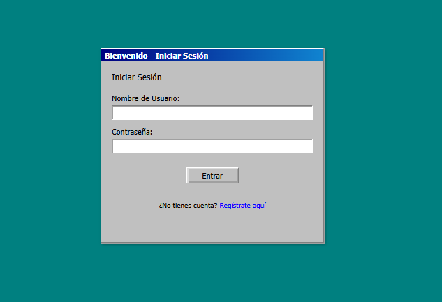

# Win98 Simulator - Tu Escritorio Retro en la Nube

¡Bienvenido a Win98 Simulator! Un proyecto personal creado por Ignacio, que recrea la nostálgica experiencia del escritorio de Windows 98 directamente en tu navegador web.

[]
## Descripción Breve

Esta aplicación web simula el entorno de escritorio clásico de Windows 98, permitiendo a los usuarios:

*   **Registrarse e Iniciar Sesión:** Cada usuario tiene su propio espacio persistente.
*   **Sistema de Archivos Virtual:** Crear carpetas y subir archivos (videos, música, texto) que se almacenan de forma segura en el servidor asociados a su cuenta.
*   **Interfaz Retro:** Disfrutar de la estética visual clásica (ventanas, iconos pixel art, barra de tareas, menú inicio básico).
*   **Reproducción Multimedia:** Ver videos y escuchar música directamente en ventanas dentro del simulador.
*   **Personalización:** Cambiar el fondo de pantalla.

El objetivo es ofrecer un servicio funcional de "escritorio en la nube" con un toque retro único.

## Tecnologías Utilizadas

*   **Backend:** Node.js con Express.js
*   **Base de Datos:** MySQL (usando `mysql2`)
*   **Frontend:** HTML5, CSS3 (personalizado), JavaScript Puro (Vanilla JS)
*   **Autenticación:** Sistema de sesiones con `express-session` y contraseñas hasheadas con `bcrypt`.
*   **Subida de Archivos:** `multer`

## Ejecución del Proyecto (Local)

Sigue estos pasos para ejecutar el simulador en tu máquina local:

1.  **Clonar el Repositorio:**
    ```bash
    git clone https://github.com/tu-usuario/win98-simulator.git
    cd win98-simulator
    ```

2.  **Instalar Dependencias:** Asegúrate de tener Node.js y npm instalados.
    ```bash
    npm install
    ```

3.  **Configurar Base de Datos:**
    *   Asegúrate de tener un servidor MySQL corriendo.
    *   Crea una base de datos (p. ej., `win98sim_db`).
    *   Importa la estructura de las tablas ejecutando el script `schema.sql` en tu cliente MySQL preferido (phpMyAdmin, MySQL Workbench, línea de comandos, etc.).
    *   Crea un usuario MySQL para la aplicación si no tienes uno y otórgale los permisos necesarios sobre la base de datos creada.

4.  **Configurar Variables de Entorno:**
    *   Copia el archivo `.env.example` (si lo creaste) a `.env` o crea un archivo `.env` nuevo en la raíz del proyecto.
    *   Edita el archivo `.env` con los detalles de tu conexión a la base de datos (DB_HOST, DB_USER, DB_PASSWORD, DB_NAME) y genera una `SESSION_SECRET` segura.

5.  **Iniciar el Servidor (Modo Desarrollo):**
    ```bash
    npm run dev
    ```
    Esto usará `nodemon` para iniciar el servidor y reiniciarlo automáticamente si haces cambios en el código.

6.  **Iniciar el Servidor (Modo Producción):**
    ```bash
    npm start
    ```

7.  **Acceder a la Aplicación:**
    *   Abre tu navegador web y ve a `http://localhost:3000` (o el puerto que hayas configurado en `.env`).

## Próximos Pasos y Contribuciones

Este proyecto está en desarrollo. Algunas ideas futuras incluyen:

*   Implementar Drag & Drop para iconos.
*   Añadir más "aplicaciones" (Bloc de Notas funcional, Visor de Imágenes, etc.).
*   Mejorar el Menú Inicio.
*   Optimizar rendimiento y seguridad.

¡Las contribuciones son bienvenidas! Si tienes ideas o encuentras bugs, por favor abre un *Issue* o un *Pull Request*.

---

Creado con ❤️ y nostalgia por Ignacio.
